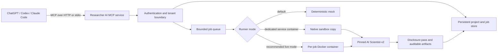

# Researcher AI

Researcher AI turns [Sakana AI's AI Scientist-v2](https://github.com/SakanaAI/AI-Scientist-v2) into an auditable MCP product for **ChatGPT, Codex, and Claude Code**.

It is more than a prompt wrapper: the repository contains rich research briefs, deterministic ranked planning, a shared MCP server, a ChatGPT Apps SDK widget, persistent tenant-isolated projects and jobs, retry deduplication, graceful cancellation, audit logs, a mandatory manuscript-disclosure pass, Codex and Claude Code plugins, local marketplace catalogs, and deployment assets for isolated execution.

> **Safety default:** installations start in deterministic `mock` mode. Live experiments execute LLM-written code and must run inside a dedicated sandbox. The public no-auth deployment must set `PUBLIC_REVIEW_MODE=stateless`; that profile exposes only status and one deterministic mock workflow, then deletes its isolated working state before returning. Never expose the persistent tool set with `AUTH_MODE=none` to the public internet.

## What is included

| Surface | Package | Purpose |
| --- | --- | --- |
| ChatGPT app | HTTP MCP at `/mcp` + single-file widget | Remote project, job, and artifact workflow |
| Codex plugin | `plugins/researcher-ai/.codex-plugin/plugin.json` | Shared skill and bundled stdio MCP server; can link to a ChatGPT app ID |
| Claude Code plugin | `plugins/researcher-ai/.claude-plugin/plugin.json` + `.mcp.json` | Shared skill, research-manager agent, and bundled stdio MCP server |
| AI Scientist integration | Pinned Git submodule + native/Docker runners | Ideation and experiment execution at commit `96bd51617cfdbb494a9fc283af00fe090edfae48` |

The local/private MCP server exposes eleven tools: service status, rich project creation/listing/dashboard, ideation start/list, experiment start, job status/cancellation, and artifact list/read. The public ChatGPT review deployment exposes two non-persistent tools: service status and a complete deterministic mock workflow that returns ranked directions plus four downloadable inline audit artifacts.

## Architecture



## Quick start

Requirements: Node.js 22+, npm 10+, Git, and Python 3 for the disclosure helper. Live AI Scientist execution additionally requires Linux, NVIDIA/CUDA/PyTorch, the upstream Python dependencies, and appropriate model-provider credentials.

```bash
git clone --recurse-submodules https://github.com/samsamurai301/Researcher-AI.git
cd Researcher-AI
npm ci
npm run validate
npm run smoke
```

Start the local HTTP service in safe mock mode:

```bash
cp .env.example .env
npm start
```

Health endpoints are `http://localhost:8000/health` and `/ready`; MCP is `http://localhost:8000/mcp`.

## Install the plugins locally

Release checkouts already contain the bundled MCP server and license files. After changing the service locally, regenerate that bundle with:

```bash
npm run build
```

Codex:

```bash
codex plugin marketplace add /absolute/path/to/Researcher-AI
codex plugin add researcher-ai@personal
```

Claude Code:

```bash
claude plugin marketplace add /absolute/path/to/Researcher-AI --scope project
claude plugin install researcher-ai@researcher-ai --scope project
```

Both local plugins use stdio MCP and default to mock execution. Set `RESEARCHER_RUNNER`, `AI_SCIENTIST_ROOT`, and provider credentials in the host environment only after reviewing [SECURITY.md](SECURITY.md).

## Live runner modes

- `mock`: deterministic integration verification; no model calls and no scientific claims.
- `native`: copies the pinned source into a job-local directory and starts Python directly. Use only when the entire service already runs in a dedicated, disposable execution container.
- `docker`: starts a resource-limited container per job. This is the intended live mode on a rootless-Docker GPU host.

Build the AI Scientist runner image:

```bash
docker build --platform linux/amd64 -f infra/Dockerfile.ai-scientist -t researcher-ai-scientist:0.2.0 .
```

See [Deployment](docs/DEPLOYMENT.md) for HTTP/OIDC and GPU-host setup, and [Publishing](docs/PUBLISHING.md) for ChatGPT, Codex, and Claude marketplace release steps.

## Development

```bash
npm run typecheck
npm test
npm run build
npm run smoke
npm run validate
```

Generated state is stored in `.researcher-ai/` by default and is ignored by Git. The service marks interrupted jobs as failed on restart so stale executions are never reported as still running.

## License and scientific integrity

The original Researcher AI wrapper is Apache-2.0 licensed. AI Scientist-v2 is a pinned third-party component under **The AI Scientist Source Code License**, which includes use restrictions and a mandatory prominent disclosure for generated scientific manuscripts, papers, and technical reports. Read [THIRD_PARTY_NOTICES.md](THIRD_PARTY_NOTICES.md) and the [complete upstream license](licenses/AI-SCIENTIST-SOURCE-CODE-LICENSE) before use or distribution.

Researcher AI inserts the required disclosure into generated TeX/PDF artifacts, but automation is not a substitute for legal review, citation verification, independent scientific review, or responsible publication decisions.
